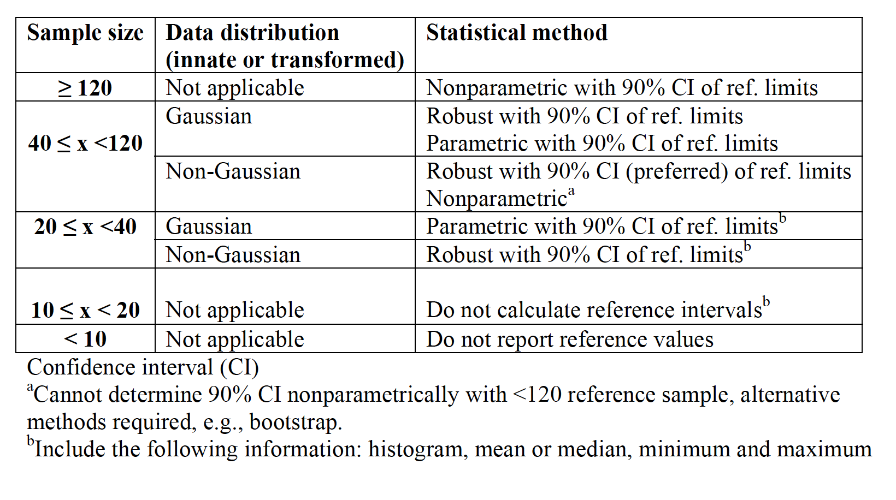

```{r setup, include=FALSE}
library(learnr)
knitr::opts_chunk$set(echo = FALSE)
library(ZooMedStat)
library(nlme)
library(survival)
library(ordinal)
library(ggplot2)
library(emmeans)
library(referenceIntervals)
library(reshape2)
library(binom)
library(pwr)
library(nparcomp)
```

```{r, echo=FALSE,out.width="40%"}

```

*© Hugues Beaufrère*

## Introduction

Thank you for using this tutorial. I hope you will find it useful.

The objectives of this tutorial are to teach you how to:

-Perform statistics in a practical way to analyze your own research

-Focus on applied computing statistics using R without dwelling on underlying statistical theories and extensive demonstrations

-Focus on statistical techniques and their implementation for common study designs used in zoological medicine

-Learn how to generate great scientific graph of publication quality

There are different modules within this course. Feel free to jump directly to the module you want to complete, but be aware that prerequisite knowledge may be needed to understand the materials. This course will take its examples from various real-life research projects on zoological animal species. While there is a focus in this tutorial on zoological medicine, everything is applicable across any veterinary clinical research discipline.

In this tutorial, we won't touch on the theory of statistics and why it is important. The tutorial is  mainly made of snippets of practical R coding for common statistical uses. However, to think as a statistician, there are concepts that I would encourage you to explore such as probabilities, the central limit theorem, distribution of random variables, sampling distribution of the mean, principles of statistical inference and so on.

The R language is one of the top data science programming languages in the world, one of the most common softwares used in scientific publishing (along with SPSS and SAS), and is completely free. It is not often in life that one of the best things available is free.

The R system is based on objects and packages. By objects, I mean that R does not generate extensive outputs, but you need to ask for what you want and save it in various object types (like a data frame or a list for instance). By packages, I mean that R comes with certain base functions, but we typically require the use of more specific or more adapted functions that people code and release in the form of R-packages that are mostly hosted on the Comprehensive R Archive Network (CRAN). Some packages are really standalone programs. For instance, we will spend more time on the package "ggplot2" as it is becoming the standard for scientific graphing.

R can be used as a standalone software, but it is far easier to use with RStudio.

Tip #1: To import a dataset with RStudio, save them as "dataname.csv" and import by clicking on environment (top right panel and then the table icon "Import", then "from text(base)".

Tip #2: If you want to restart this tutorial, go on the left panel, scroll to the bottom, and press "start over".

Tip #3: if you need assistance in coding in R, you can ask chatGPT to come up with R codelines for particular analysis and the results are often pretty good. Check it out on chat.openai.com


## The R environment {data-progressive=FALSE}

### An advanced calculator
First, R works like a mathematical calculator, so you can use it as such for a variety of applications. You just need to know the codes, which are fairly intuitive to calculate what you need. For instance square root is sqrt(), exponent is exp(), and 10^20 is 1e20.

*Try to enter some calculus and see what happens (example: 3+4 or sqrt(56))*

```{r calculus,exercise=TRUE }

```

You can also generate lists of numbers, this can be handy for some specific applications.

*Run the code*
```{r numbers, exercise=TRUE}
3:10 #gives you all numbers between 3 and 10
seq(1,10,by=0.5) #gives you numbers between 1 and 10 by 0.5 increments
rep(1:3,times=3) #repeats a vector of numbers
```
*Another thing that you need to know in R studio is that you can run lines separately or one by one by placing the cursor on it and pressing command+return on mac or CTRL+return on PC. If you want to run a small chunk, just do the same after selecting the chunk with the mouse. Try it above.*

### R objects

R works with objects that can be of various types. They can be lists of numbers, lists of text strings, matrix, datasets (called dataframes), or output objects.
Let's start with simple objects. First we'll make a list of numbers, for instance the mean weight of some parrot species. The list is entered using the letter c and then you assign it with an arrow to an object. You can choose whatever name you want for that list.
In the following codelines, I created a list of weight.


*Run the code*
```{r make_a_list, exercise=TRUE}
c(450,400,140,200,120,90,35)->weight
```
Nothing happens, right!, it is because you entered numbers into a list, but if you want to see it again, you need to call it. Let's try it, go back to the chunk above, and type the name of the list right below the list generation codeline.

Ok, you can also use calculus with lists and apply functions.

*The "weight" list is in grams, try to transform it in kg, then try to log transform it*
```{r transform_weight-setup}
c(450,400,140,200,120,90,35)->weight
```
```{r transform_weight, exercise=TRUE}

```
```{r transform_weight-solution}
#weight/1000 or weight/1e3
#log(weight)
```
To save your calculation or transformation you will need to save the file into an R-object, you can overwrite weight for instance with "weight/1000->weight"

Another thing, it can be annoying to have lots of numbers after the decimal point. You can round up your data in R and tell the software how much precision you want using the command round(). See there:
```{r round-setup}
c(450,400,140,200,120,90,35)->weight
```
```{r round, exercise=TRUE}
round(weight/1000,2)
```


Alright, you can make lists with strings of text too

*Run the code*
```{r species_list, exercise=TRUE}
c("Grey parrot","Amazon parrot","Caique","Lorie","Quaker parrot","Cockatiel","Budgerigar")->parrots
parrots
```

You can combine these two lists into a matrix if you want, either combine them by columns or by rows.

*Run the code*
```{r combine_lists-setup}
c(450,400,140,200,120,90,35)->weight
c("Grey parrot","Amazon parrot","Caique","Lorie","Quaker parrot","Cockatiel","Budgerigar")->parrots
```
```{r combine_lists, exercise=TRUE}
cbind(weight,parrots)->data1
rbind(weight,parrots)->data2
data1
data2
```


## Data cleaning, organization, and subsetting {data-progressive=FALSE}

In this first part, we'll learn how to evaluate your dataset and look for errors as well as making sure all variables are correctly categorized.
First I have put example datasets into the package ZooMedStat that are already loaded in the background.

### Data cleaning and examination
Let's use the dataset "norepi", let's call it and look at it

*norepi*
```{r}
norepi
```

You can quickly look at it and it seems to be ok. However, go to the last page of this dataset.

```{r quiz1}
quiz(
  question("What is wrong with this dataset?",
    answer("Nothing"),
    answer("Extra rows that do not match the variables", correct=TRUE),
    answer("Extra columns that do not match the variables"),
    answer("Too many missing values"),
    correct="Damn right! the researcher put extra rows at the end to define acronyms and when it got imported, it messed up the entire dataset"
  ))
```

Let's clean it up. If you go on page 8, you'll see that the last legit row is the row 72.
So we'll take a subset of this and overwrite the parent dataset. To subset a r*c data frame, you use these brackets []. The first value is for the rows and the second for the columns. The ":" sign means "to".

*Run the code*
```{r clean_norepi, exercise=TRUE}
norepi[1:72,]->norepi
norepi
```

When you import datasets into R, make sure there are no extra information that do not belong to the dataset and make sure all cells with missing values are left blank.

If you just want to look at the first few rows, you can do this (you will also see all the variables this way in this exercise). For the opposite, to see the last few rows, replace "head" by "tail"
```{r clean_norepi_head, exercise=TRUE}
head(norepi)
```

You can also extract the different variables (in the form of columns) using the $ sign. For r*c data frames, you need to put a comma to indicate the 2 dimensions (rows and columns). Let's look at the heart rate for instance.

*Example*
```{r norepi_hr-setup}
norepi[1:72,]->norepi
```
```{r norepi_hr, exercise=TRUE}
norepi$hr
```

Now, try to look at a factor, call for the factor trt, which represents the different treatments of this experiment.
```{r norepi_trt, exercise=TRUE, exercise.setup="norepi_hr-setup"}

```
```{r norepi_trt-solution}
norepi$trt
```
You can see that it gives you the factor levels at the end also. There is a better way to just get the levels of a factor, just to make sure there are no issues there (extra unintended levels will lead to unwanted comparisons when you run the stats)
```{r norepi_trt_levels, exercise=TRUE, exercise.setup="norepi_hr-setup"}
levels(norepi$trt)
```
Darn! The software counted some missing values (or maybe extra spaces instead of a truly blank cell on excel) as factor level in itself. This happens commonly. To get rid of it so it does not parasitize your analysis, you need to tell R which levels you want to keep. At this occasion, you can also tell R in which order you want them to be when you graph them.
```{r norepi_trt_levels_correct, exercise=TRUE, exercise.setup="norepi_hr-setup"}
factor(norepi$trt,levels=c("awake","baseline","low dose","medium dose","high dose","before recovery"))->norepi$trt
levels(norepi$trt)
```
You can also get the number of instances that each level of a factor was used in an experiment with this code:
```{r trt_level-setup}
norepi[1:72,]->norepi
factor(norepi$trt,levels=c("awake","baseline","low dose","medium dose","high dose","before recovery"))->norepi$trt
```
```{r trt_level, exercise=TRUE}
xtabs(~norepi$trt)
```

Now, remember that there were some additional rows with text information at the bottom of the dataset that interfered with it. We cleaned it up, but it had the deleterious effect of having R considered one of the variable as a factor when, in fact, it is a numeric variable. 
```{r}
norepi[1:72,]->norepi
```
```{r class, exercise=TRUE, include=TRUE}
class(norepi$weight)
```
You cannot get the mean or do any other calculations from a factor, so you need to either correct the excel sheet and reimport it into R or tell R to consider this variable as a number.
First let's try this:
```{r trt_number, exercise=TRUE, exercise.setup="trt_level-setup"}
as.numeric(norepi$weight)
```
Mmmh, what the heck just happened?
Actually, R just gives a number to each level of the factor. You need to convert it to text first, then to a number.
```{r trt_number2, exercise=TRUE, exercise.setup="trt_level-setup"}
as.numeric(as.character(norepi$weight))->norepi$weight
norepi$weight
```

The opposite may also occur for some factors that use numbers as labels and should not be considered as a number by R. This can later create some issues when modelling data.
In our case, the first variable, the ID variable, gives number to animals, but these numbers are not really more meaningful than having animals' names. Let's conver that to a factor.
```{r id_factor, exercise=TRUE}
as.factor(norepi$id)->norepi$id
levels(norepi$id)
```

There are some missing data points in this dataset. That means that, by default, R will remove the entire row of information when encountering these (listwise deletion). So you may want to have quick overview of the missing data distribution.
```{r missing, exercise=TRUE, exercise.setup="trt_level-setup"}
sum(is.na(norepi$sap)) # get the number of missing values for one variable
summary(norepi) # get the number of missing values for all, last row of the table
```

Last, if you want to manually edit a dataset, then you can do that:
*Note/ there will be a pop up window, do your edit and close it*
```{r editing_manually, exercise=TRUE, exercise.setup="trt_level-setup"}
edit(norepi)->norepi
norepi
```


### Data re-organization and subsetting

#### Select rows and columns

Now, you may want to work with only parts of this dataset.
We have already reviewed the code to select only a subset based on rows and columns. Let see if you remember.

*Select the first 3 columns. Then try to select only the row 3 to 5.*
```{r subsetting1, exercise=TRUE, exercise.setup="trt_number2"}

```
```{r subsetting1-hint}
norepi[,1:3] #for the first one, try to do the second one on your own.
```
```{r subsetting1-solution}
norepi[3:5,]
```

Let's try something harder, just extract the rows 1, 5, 7 and 15. (click on the hint for help if you are stuck)
```{r subsetting2, exercise=TRUE, exercise.setup="trt_number2"}

```
```{r subsetting2-solution}
norepi[c(1,5,7,15),]
```
Now try to select all the rows, except the row 5
```{r subsetting3, exercise=TRUE, exercise.setup="trt_number2"}

```
```{r subsetting3-solution}
norepi[-5,]
```

#### Filter by a variable

You can also subset based on a value of a variable whether it is a factor or a numeric variable. This is handy when you want to subset with values that are spread out in the dataset.
*Example: Subsetting the data frame for the low dose treatment*
```{r subsetting4, exercise=TRUE, exercise.setup="trt_number2"}
norepi[norepi$trt=="low dose",]
```

To do the opposite, subsetting by removing data containing a certain value, you can do that (the sign different in R is !=):
*Removing data for treatment with a low dose of norepinephrine*
```{r subsetting4bis, exercise=TRUE, exercise.setup="trt_number2"}
norepi[norepi$trt!="low dose",]
```

#### Filter by a value

Sometimes you have a huge range of values for a variable and you want to restrict the analysis for a certain set of values. For this, you can subset your dataset this way:
*Example: Subsetting the data frame for all rows for which heart rate is below 200*
```{r subsetting5, exercise=TRUE, exercise.setup="trt_number2"}
norepi[norepi$hr<200,]
```


#### Reorganize by a variable
Let say now that you want to reorganize your dataset so it is organized by treatment, you may need that for practical reasons.
```{r reorganize1, exercise=TRUE, exercise.setup="trt_number2"}
norepi[order(norepi$trt),]->norepi
norepi
```

#### Wide or long data set
Now, there are 2 ways to organize a whole dataset: the long and wide format. The "norepi" dataset is already organized in the long format, which is the most useful for statistical analysis using R. That means that there is only one variable per column and for variable that don't vary, the values get repeated. You can see this organization below:
```{r}
norepi
```

The wide format is when the categorical data are grouped in columns instead of being values in a single column. The result is that instead of having one variable per column, you have a variable that spans several columns.
*Long to wide format for the heart rate*
```{r wide, exercise=TRUE, exercise.setup="trt_number2"}
dcast(norepi[,c(1,4,6)],id~trt,value.var="hr")
```
*Note/the Var.2 thingy is for the missing data, you can remove it later by subsetting*
You may not immediately see the point. But some statistical tests and some graphs may require your data to be in this format. Let say you want to do easy barplots and have one variable per bar, then wide format would be easier.

If your data is in the wide format (you imported it this way from an excel file and it would take a lot of time to convert it to long manually), you will probably have to convert it into a long format for statistical analysis.
```{r long-setup}
norepi[1:72,]->norepi
dcast(norepi[,c(1,4,6)],id~trt,value.var="hr")->norepi.wide
```
```{r long, exercise=TRUE}
melt(norepi.wide,idvar=c("id"))
```


## Descriptive statistics and Data exploration {data-progressive=FALSE}
We'll use the dataset OwlCBC.
```{r}
OwlCBC
```

### Basic functions
There are some cool and quick functions that you can use to have an initial feel of your data:
```{r basic_functions, exercise=TRUE}
sort(OwlCBC$pcv) #sort ascending or alphabetically
table(OwlCBC$species) #gives counts of values
unique(OwlCBC$pcv) #gives you all the unique values of a variable
duplicated(OwlCBC$pcv) #inform you of duplicates for particular values
```

### Basic numbers and data distribution
Descriptive statistics mean that you want to provide summaries for your data. To summarize data, you typically need 2 pieces of information: a measure of central tendency and a measure of spread. You should not report one without the other. 
There are essentially two types of measures of central tendency, the mean (like an average) and the median (the value below and above which 50% of the data are). 
There are also two main types of measures of spread that are commonly used, the standard deviation and the interquartile range (the value representing the width between the 25% and 75% quantiles)

They are fairly easy to get with R.
*Calculating the mean and median for pcv of owls*
```{r descriptive, exercise=TRUE}
mean(OwlCBC$pcv,na.rm=T) #the code "na.rm=T" tells R to run the command despite missing data
median(OwlCBC$pcv,na.rm=T)
sd(OwlCBC$pcv,na.rm=T)
IQR(OwlCBC$pcv,na.rm=T)
```

Now, before we get any further, there is a mistake that you should not make. In the dataset OwlCBC, each row is a different bird. However, in the dataset norepi, it is in a long format and animals are repeated in rows because it is a repeated measure analysis. If you just do the mean or sd (or anything else) from that, you will calculate values including all the duplicates.
Let's illustrate this:

```{r duplicate, exercise=TRUE}
sd(norepi$hr, na.rm=T)
```
 Then let's do that removing the duplicates and compare the new mean:
```{r duplicate2, exercise=TRUE}
sd(norepi$hr[!duplicated(norepi$id)], na.rm=T)
```
So make sure you tell R to remove duplicates when getting descriptive statistics from repeated measure datasets.

To be able to use the mean and sd, you need to have your data follow a normal distribution (bell curve). If that is not the case, then the mean will not be a good measure of central tendency, so you need to use the median and the sd will not be a good measure of spread, so you need to use the IQR. For normally-distributed data, the mean=median. The median is never wrong to use as it will always be meaningful.

To check for normal distribution, you can first look at the distribution of your data:
```{r freq, exercise=TRUE}
hist(OwlCBC$pcv,nclass=30)
```
```{r quiz2}
quiz(
  question("Does it seem to have a bell-curve?",
    answer("Yes",correct=TRUE),
    answer("No"),
    correct="Awesome, yes it looks roughly like a bell curve"
  ))
```

You can also use formal tests such as the Shapiro-Wilk test, but there are many others. The test tests for departure of the normal distribution, so if its p-value is below 0.05, then the departure from normal distribution is significant and your data should not be considered normal.
*Let's give it a try*
```{r shapiro, exercise=TRUE}
shapiro.test(OwlCBC$pcv)
```
So it confirms that it is normally distributed

Formal normality tests are not very powerful and do not perform well on low sample sizes. In our case, we should be confident since we have 276 observations.

Another way to check for normality is to do a normal quantile plot. It plots your data against the normal distribution. If it is a straight line, then it is normally distributed.
```{r quantile_plot, exercise=TRUE}
qqnorm(OwlCBC$pcv)
qqline(OwlCBC$pcv)
```

So it is not completely on that line, so likely not completely normally distributed, but close.

#### EXERCISE
Now, get me the best measure of central tendency and spread for the variable wbcL (white blood cell counts determined with leukopette).
*Note/ if you want to run only one line instead of the whole thing, just click on that line, then press Alt+Enter in PC and Command+Enter in Mac.*
```{r exercise1, exercise=TRUE}

```
```{r quiz3}
quiz(
  question("Was it normally distributed",
    answer("Yes"),
    answer("No",correct=TRUE)),
  question("Which summary statistics did you use?",
    answer("mean and standard deviation"),
    answer("median and interquartile range",correct=TRUE)
           )
  )
```

Other descriptive statistics include minimum, maximum, and various quantiles using the following functions:
```{r other_functions, exercise=TRUE}
min(OwlCBC$pcv,na.rm=T)
max(OwlCBC$pcv,na.rm=T)
quantile(OwlCBC$pcv,na.rm=T) #gets you the standard quantiles used in a boxplot
quantile(OwlCBC$pcv,probs=c(0.025,0.975),na.rm=T) #gets you defined quantiles such as for a non-parametric reference interval for instance
```


### Group Descriptions
Now, you may want to get summary statistics for your whole table to go quicker.
You just need to ask for a summary:
```{r summary, exercise=TRUE}
summary(OwlCBC)
```
Unfortunately, you don't get the standard deviation with that.
To get the standard deviation for all columns, you can do this:
```{r summary2,exercise=TRUE}
sapply(OwlCBC[,-1],sd,na.rm=T) #we removed the first column as it is a factor
```

Your turn! Get me the interquartile range for all variables of that table.
```{r summary3,exercise=TRUE}

```
```{r summary3-solution}
sapply(OwlCBC[,-1],IQR,na.rm=T)
```

Another thing you may want is a summary statistic, such as the mean, as a factor of another variable.
For instance, it does not make sense to report the overall PCV for owls, we want instead the PCV by owl species:
```{r summary4, exercise=TRUE}
by(OwlCBC$pcv,OwlCBC$species,mean,na.rm=T) #the "na.rm=T" allows to use data with missing values. Remove it if you want to see the results.
```
Now, give me the sd of wbcL by species:
```{r summary5, exercise=TRUE}

```
```{r summary5-solution}
by(OwlCBC$wbcL,OwlCBC$species,sd,na.rm=T)
```

### Data transformations
Data transformation using R is pretty easy. The goal of data transformation, in most instances, is to approach a normal distribution so you can use parametric statistics on it.
If you remember, the pcv of owls was not normally distributed, but fairly close.
```{r}
"Q-Q plot"
qqnorm(OwlCBC$pcv)
qqline(OwlCBC$pcv)
```

Let's do a log transformation and do the Q-Q plot again. I think you can do it, click on "solution" if you are stuck.
```{r transform, exercise=TRUE}

```
```{r transform-solution}
log(OwlCBC$pcv)->OwlCBC$pcv
qqnorm(OwlCBC$pcv)
qqline(OwlCBC$pcv)
```
It seems to have worked. If you run a Shapiro-Wild test, you'll see that it checks out there too.
```{r transform2, exercise=TRUE}
shapiro.test(log(OwlCBC$pcv))
```

If you do anything on this transformed data, you need to transform back for interpretation. In the case of the mean, if you transform back (exponent), then you get the geometric mean.
```{r trasnform3, exercise=TRUE}
log(OwlCBC$pcv)->OwlCBC$pcv
exp(mean(OwlCBC$pcv,na.rm=T))
```

If you get an error with log transformation, it is possible that it is due to the presence of 0s in your dataset as log(0) is impossible. In this case, you can replace 0s by very small values such as 0.001 for instance (use the edit function if you want to do that)
```{r log, exercise=TRUE}
log(0)
```

Other classic transformations include square root, exponentiation, rank, and Box-Cox transformations. Transforming your data will significantly increase the difficulty of interpreting the results. Overall, it is best to just use non-parametric statistics for non-normal data whenever possible.

### Descriptive graphs
As the saying goes: a picture is worth a thousand statistical codelines!

#### Boxplots
The best graph you can do to summarize data is a boxplot. The boxplot gives you the median (central line in the box), the interquartile range (box), minimum and maximum (whiskers) and outliers (points on the outskirt).
A quick way to do it in R is:
```{r boxplot, exercise=TRUE}
boxplot(OwlCBC$pcv~OwlCBC$species,las=2,xlab="",ylab="PVC (L/L)") #las=2 puts the species name at a 90 degree angle so they don't overlap
```
Modify the codeline to get the same for wbcL and wbcS

A better way to do it with GGPLOT2 (the best package for graphing) is:
```{r boxplot2,exercise=TRUE}
ggplot(OwlCBC,aes(x=species,y=pcv))+geom_boxplot(aes(fill=species))+xlab("Species")+ylab("PCV (L/L)")+theme_classic()+theme(text=element_text(size=15),axis.text.x=element_text(angle=40,hjust=1),legend.position="none")
```

Note/ we'll talk more about GGPLOT2 in the "Advanced Scientific Graphing" module, so don't stress too much about the coding.

#### Bargraphs
You can do barplots too, but they are not great to summarize data in general. Here is the ggplot code for a barplot accross species with errorbars.
```{r barplot1,exercise=TRUE}
ggplot(data=OwlCBC,aes(x=species,y=pcv))+stat_summary(geom="bar",fun.y=mean,position="dodge",aes(fill=species))+stat_summary(geom="errorbar",fun.data=mean_se,position="dodge")+theme_classic()+theme(text=element_text(size=15),axis.text.x=element_text(angle=40,hjust=1),legend.position="none")
```
With ggplot, you have to code for every single little thing in the graph that you want. The first part calls the different variables, then the stat_summary thingy asks for the mean in a bar form, then the errorbars and then there are some formatting bits and pieces. Again, we'll review ggplot later so please relax.

#### Scatterplots
Scatterplots do not perform any statistics, they just graph each data points as is. They can be very useful in some instances. You typically use them when graphing 2 continuous variables together on the same plot.

For instance, we'll compare the WBC in owls obtained using 2 different techniques on a scatterplot.
The quicker way to do it in R using its base function is this:
```{r scatterplot,exercise=TRUE}
plot(OwlCBC$wbcL,OwlCBC$wbcS)
```
You can add a reference line at x=y (the 2 techniques are identical) by adding abline(0,1) in an extra line to the codeline above (note: 0 is the intercept and 1 the slope)

Again, with ggplot, you can do better stuff using the geom_point graphical function and some nice formatting codes. See for yourself:
```{r scatterplot2, exercise=TRUE}
ggplot(data=OwlCBC,aes(x=wbcL,y=wbcS))+geom_point(aes(color=species))+geom_abline(intercept=0,slope=1)+theme_classic()+theme(text=element_text(size=15))
```
Note/ Did I tell you that we would review ggplot codes later or that you could jump directly to the "Advanced scientific graphing" module if you just cannot wait.

## Refererence Intervals
Firt real application of statistics to an actual study. In veterinary medicine, we try to follow the statistical guidelines from the ASVCP, which are as described in the table below:

*ASVCP Guidelines: Recommended procedures for establishing RI based on reference sample size and distribution*
```{r, echo=FALSE,out.width="80%"}

```

You can see that there are many different techniques. The recommended technique depends both on sample size and on data distribution.
Let's use the dataset OwlCBC again
```{r}
OwlCBC
```

We'll determine reference intervals for the white blood cell count determined using a Leukopette technique (wbcL).
First we need to get the sample size:
```{r sample_size, exercise=TRUE}
length(OwlCBC$wbcL) #overall sample size for wbcL - includes missing value
length(OwlCBC$wbcL)-sum(is.na(OwlCBC$wbcL)) #true sample size without the missing values
table(OwlCBC$species) #sample size by species
```

ok, we'll first determine the overall reference interval for all the owl species combined.
Do you remember how to check whether wbcL is normally distributed (you did it before)?
```{r normality, exercise=TRUE}

```
```{r normality-solution}
shapiro.test(OwlCBC$wbcL) #Shapiro-Wilk test
qqnorm(OwlCBC$wbcL) #quantile plot technique
qqline(OwlCBC$wbcL)
```

```{r quiz4}
quiz(
  question("What reference interval technique should we use?",
    answer("Parametric"),
    answer("Non-parametric",correct=TRUE),
    answer("Robust")
  ))
```

Then you need to give basic summary statistics.
```{r reference1,exercise=TRUE}

```
```{r reference1-solution}
median(OwlCBC$wbcL)
min(OwlCBC$wbcL)
max(OwlCBC$wbcL)
IQR(OwlCBC$wbcL)
```

Ok, for the reference interval in itself, we will use the package referenceIntervals which complies with the ASVCP guidelines. It is very easy to use, all you need to do is this:
```{r reference2,exercise=TRUE}
refLimit(OwlCBC$wbcL,out.method="horn",RI="n") #out.method is for outlier determination and for RI methods you can use n for non-parametric, p for parametric, and r for robust
```

Ok, so it gives you already everything that you want, the 95% reference interval with the 90% confidence intervals on the upper and lower limit. Please note that the sample size did not exclude missing value.
Sometimes, you need to remove outliers depending on whether it is indicated (laboratory error, too extreme, please read the ASVCP guidelines)
Let's remove the 0.38 outlier which is fairly extreme.
```{r reference3,exercise=TRUE}
refLimit(OwlCBC$wbcL[OwlCBC$wbcL!="0.38"],out.method="horn",RI="n")
```

If you want to remove all outliers, just add out out.rm=TRUE to the codeline. Note that it was not successful to determine the confidence interval around the upper limit. That happens sometimes.

### EXERCISE
Ok, now we don't really report reference intervals for a whole order of birds, but mainly at the species level.
Could you get the reference interval for great horned owl (GHOW) using the appropriate method complying with the ASVCP guidelines?
```{r reference4, exercise=TRUE}

```
```{r reference4-solution}
shapiro.test(OwlCBC$wbcL[OwlCBC$species=="GHOW"]) #it's normally distributed
table(OwlCBC$species) #sample size is 35
mean(OwlCBC$wbcL[OwlCBC$species=="GHOW"],na.rm=T) #summary statistics
sd(OwlCBC$wbcL[OwlCBC$species=="GHOW"],na.rm=T)
min(OwlCBC$wbcL[OwlCBC$species=="GHOW"],na.rm=T)
max(OwlCBC$wbcL[OwlCBC$species=="GHOW"],na.rm=T)
refLimit(OwlCBC$wbcL[OwlCBC$species=="GHOW"],out.method="horn",RI="p") #we used a parametric technique
```

## Basic Epidemiologic Analysis
For this section, we'll work with the QuakerEpidemio dataset, which includes data on the frequency of lipid related disorders in Quaker parrots.

```{r}
QuakerEpidemio
```

The prevalence is the rate of disease at a certain time. It is different from the incidence, which is the rate of new cases per unit of time.

For instance, let's get the prevalence of hepatic lipidosis:

```{r prevalence, exercise=TRUE}
table(QuakerEpidemio$lipidosis) # count the number of Quakers with and without the disease
prop.table(table(QuakerEpidemio$lipidosis)) # convert to percentages
```

I let you do the same for the prevalence of atherosclerosis

```{r prevalence2, exercise=TRUE}


```
```{r prevalence2-solution}
table(QuakerEpidemio$atherosclerosis)
prop.table(table(QuakerEpidemio$atherosclerosis)) 
```

When reporting prevalences (and percentages in general), it is optimal to report the 95% binomial confidence interval as well. You can do that using the R-package "binom".
Instead of putting the percentage directly, you need to provide the number of positives and the sample size. The code below is for the confidence interval for the prevalence of hepatic lipidosis.

```{r prevalence3, exercise=TRUE}
binom.confint(87,411,conf.level=0.95,methods="all")
```
It gives the results using several methods. I typically use the asymptotic method.

Alright, now you may want to get the prevalence by sex for instance, and maybe compare these prevalences. For this, you can start by doing a contingency table.

```{r prevalence4, exercise=TRUE}
prop.table(table(QuakerEpidemio$lipidosis,QuakerEpidemio$sex))
```

mmh, you can see that males seem to have a higher prevalence than females. To compare proportions, a chi-square test can be done:

```{r prevalence4chi, exercise=TRUE}
chisq.test(table(QuakerEpidemio$lipidosis,QuakerEpidemio$sex))
```

Indeed, you see that it is highly significant with a p=0.001

Note that there are lots of missing values for sex, so you removed quite a few birds for these statistics. It would be best to use multiple imputation to deal with missing values in this example rather than listwise deletion. It is pretty complicated, so we won't cover it, but it is good to be aware that there are statistical procedures to circumvent some issues associated with missing values.
Do you remember how to get the rate of missing values for sex in this dataset:

```{r prevalencemissing, exercise=TRUE}


```
```{r prevalencemissing-solution}
sum(is.na(QuakerEpidemio$sex)) #number of missing data points
sum(is.na(QuakerEpidemio$sex))/length(QuakerEpidemio$sex) #percentage of missing values for sex
```

Now, get me the prevalence of atherosclerosis in Quaker parrots by sex with confidence intervals. Please test whether the prevalence is significantly different by sex.

```{r prevalence5, exercise=TRUE}


```
```{r prevalence5-solution}
table(QuakerEpidemio$atherosclerosis,QuakerEpidemio$sex)
prop.table(table(QuakerEpidemio$atherosclerosis,QuakerEpidemio$sex)) 
binom.confint(5,146,conf.level=0.95,methods="asymptotic")
binom.confint(11,141,conf.level=0.95,methods="asymptotic")
chisq.test(table(QuakerEpidemio$atherosclerosis,QuakerEpidemio$sex))
```
```{r quizprevalence}
quiz(
  question("Is the prevalence of atherosclerosis different by sex in this species?",
    answer("Yes"),
    answer("No",correct=TRUE)
  ))
```

We could investigate the other risk factors in that dataset, but that would require the use of a logistic regression. We'll come back to that in the chapter on categorical data analysis and logistic regression.

## Setting up an experiment

There are different steps you need to follow to set up an experiment.

### Choosing an experimental design
- First, you need to decide of a design depending on your research hypothesis and research contraints.
The most common types of experiments include the complete randomized design (most basic design, testing all levels of 1 factor), the block randomized design (controlling for a particular confounding variable such as observer or sex for instance), the full factorial design (testing all combinations of several factors) and the repeated measure design (which can be a cross over study). Most of these designs will be analyzed using t-tests, anova, linear models or linear mixed models.

### Sample size analysis
- Second you need to decide on a sample size. It is typically done using a sample size analysis. You need to consider different parameters such as an alpha=0.05 (rate of type I error), a power of 80% (probability of finding an effect, also means a rate of type II error of 20%), the expected variability of the data (is it more like 5% or 20%), and the effect size (can be estimated using Cohen's d with 0.2 being small, 0.5 being medium, and 0.8 being large for instance). You typically either specify the different means and variability or the effect size, which takes that into consideration.

Let's go through some examples just using the effect size as it is simple. I won't cover all the different types of analysis for which you would need a sample size analysis, just the most common.

For instance, we would like to compare the white blood cell counts between 2 related owl species, the great horned owl and the snowy owl (dataset OwlCBC).
```{r}
OwlCBC
```

#### Two sample study
We would like to know how many owls in each species we would need to sample controlling for a type I error of 5%. We could also think that the difference is expected to be high considering that they are coming from different biotopes, so let's try an effect size of 0.8.

```{r power, exercise=TRUE}
pwr.t.test(d=0.8,sig.level=0.05,power=0.8, type=c("two.sample"))
```

Let's check our sample size in the OwlCBC dataset
```{r power2, exercise=TRUE}
length(OwlCBC$species[OwlCBC$species=="GHOW"])
length(OwlCBC$species[OwlCBC$species=="SNOW"])
```
We are close to what is recommended, but we have an uneven sample size.
Let's do a t-test see what we got.
```{r power3,exercise=TRUE}
t.test(OwlCBC$wbcL[OwlCBC$species=="GHOW"],OwlCBC$wbcL[OwlCBC$species=="SNOW"])
```
So we got a significant difference. You can see what the effect size was with the following code keeping the same alpha and power.
```{r power4, exercise=TRUE}
pwr.t2n.test(n1=35,n2=13,power=0.8,sig.level=0.05)
```
You see that the effect size was actually quite large, which allowed us to find the difference with our constraints.
If the difference between the 2 species was milder, it would have been hard to find it. Let's say, you would like to run the same analysis with the same exact sample sizes, but for 2 species that are more similar in white blood cell count, and you expect a moderate effect size this time.

```{r power5, exercise=TRUE}
pwr.t.test(d=0.5,power=0.8,sig.level=0.05,type=c("paired"))
```
You would need at least 60 animals in each group.
If you want to do the same, but for paired sample (using the same individuals for comparisons), you just need to change "two.sample" for "paired" in the above codeline, please try it.

Now, try to think of one of your past studies that was a 2-sample simple study. Estimate the effect size and keep the alpha and power at the same levels as in the examples. Compare the sample size that you got with what you used in your study and whether or not you were able to find a difference.
```{r power6,exercise=TRUE}

```
```{r power6-hint}
pwr.t.test(d=effect size,power=0.8,level=0.05) #d=0.2 for small, d=0.5 for medium, d=0.8 for large
```

#### More than 2 groups
That would be an ANOVA to compare results between different treatments/groups, but belonging to the same variable (the variable treatment for instance or in our case, the variable species)
Let's look at the same size per species for white blood cell counts of owls to see if there is species that differs from the others.
First, let's see the number of owl species that we have. Please try to get it yourself.
```{r power7, exercise=TRUE}


```
```{r power7-solution}
length(unique(OwlCBC$species))
```

You can do the sample size analysis with an expected large effect size for at least one species to differ from the others using this codeline.
K is the number of groups and f is the effect size there (ANOVA is a F-test). In this situation, a small effect size would have f=0.1, a medium f=0.25, and a large f=0.4.
```{r power8, exercise=TRUE}
pwr.anova.test(k=13,f=0.4,sig.level=0.05,power=0.8)
```

As we did earlier, let's then look at our actual sample size per species to compare with what we should have had, I let you do it.
```{r power9, exercise=TRUE}

```
```{r power9-solution}
table(OwlCBC$species)
```
So it seems that we have n=9 for most species, let's run an ANOVA, we should find a difference if the effect size is indeed large:
```{r power10, exercise=TRUE}
anova(lm(data=OwlCBC,wbcL~species))
```
Awesome, we indeed got a significant difference. Then you would have to do a post-hoc test to see which species are different from which (see later).

If you want to run other power analysis/sample size analysis, please look at other functions of the package pwr. You can also download the free software G*power, which is great at:
https://www.psychologie.hhu.de/arbeitsgruppen/allgemeine-psychologie-und-arbeitspsychologie/gpower.html

### Randomization
- Third, you need to randomize the treatment to the experimental units. The randomization needs to follow the rules of the design, so for blocked designs or cross-over studies, there will be added steps. In general, you need a number of animals that is a multiple of the number of treatments for a balanced design.

#### Simple randomization

Let's start by how to randomize a simple experiment such as a complete randomized design.
Let say that you want to study the effect of 2 drugs (plus control, so 3 treatments total) on birds. 
You expect a large effect size, how many different birds do you need per group:
```{r crd1,exercise=TRUE}

```
```{r crd1-solution}
pwr.anova.test(k=3,f=0.4,sig.level=0.05,power=0.8)
```
Ok, you should have gotten about 21 birds per group, so a total of 63 birds. Let's assume that the birds ID are #1 to #63.
Now let's assign Treatment 1, Treatment 2, anc Control to the birds.
First the command to take a random sample is the following, so we are taking 21 birds at random in our colony of 63 birds.
```{r randomization1, exercise=TRUE}
sample(63,21)
```
The issue is that you need to do that 3 times without replacement. So let's sample all 63 birds and put them in 3 columns instead:
```{r crd2,exercise=TRUE}
matrix(sample(63,63),ncol=3)
```
Then you can assign the treatment names to the columns:
```{r crd3,exercise=TRUE}
matrix(sample(63,63),ncol=3)->experiment1 #same as above, but saves it into a matrix you can recall
c("Treatment 1","Treatment 2","Control")->trt #make a list of the treatment names
sample(trt,3)->colnames(experiment1) #assigns the treatment names to the column in a random fashion
experiment1 #recalls the design so you can see it
```
Here you go!

Your turn. You have a colony of 24 bearded dragons (called 1 to 24) and you want to test the effect of 3 doses of alfaxalone (5 mg/kg, 10 mg/kg, and 15 mg/kg) on the duration of sedation. You want to compare it to your control protocol to see if it is better (propofol 10 mg/kg IV). Each bearded dragon only receives one dose, so it is a complete randomized design.
Randomize the experiment:
```{r randomization2, exercise=TRUE}


```
```{r randomization2-solution}
matrix(sample(24,24),ncol=4)->dragon.experiment
c("A 5mg/kg","A 10 mg/kg","A 15 mg/kg","P 10 mg/kg")->trt
sample(trt,4)->colnames(dragon.experiment)
dragon.experiment
```
To randomize a factorial design with several factors, each having several levels, you just do as for the complete randomize design with all the combinations.
For instance, you want to see the effect of one drug at 3 doses (plus control) and 3 different temperatures on the length od sedation of bearded dragons. You would consider this as a complete randomized design with 4*3=12 treatments. So you would need quite a number of bearded dragons for such a study.

#### Blocked design

Keeping the examples of the bearded dragon alfaxalone study. Imagine now that you would like to take into considerations the effect of sex (males vs females). Then you would need to have each group get an equal number of males and females (you are blocking for sex) in case there is a sex effect. The effect of sex on the duration of sedation is not your primary outcome of interest, but you cannot discount it and it is best to account for it in the design by blocking for sex.
So we have 24 dragons, let's say that sex is randomly distributed in this dataset. Let's make an object that accounts for this:
```{r blocked1,exercise=TRUE}
seq(1:24)->ID
c(rep("female",12),rep("male",12))->sex
sample(sex,24)->sex
cbind(ID,sex)->dragons # combine the lists by rows
as.data.frame(dragons)->dragons #transform it as a data.frame, which is easier to manipulate
dragons
```
Ok, so the easiest would be to randomize the females separately from the males. For this, we'll create 2 matrices and do what we did above for each matrix, then we'll combine them and assign labels to the columns (treatments) and rows (sex). You basically randomize within blocks
```{r randomization3-setup}
seq(1:24)->ID
c(rep("female",12),rep("male",12))->sex
sample(sex,24)->sex
cbind(ID,sex)->dragons # combine the lists by rows
as.data.frame(dragons)->dragons #transform it as a data.frame, which is easier to manipulate
dragons
```
```{r randomization3,exercise=TRUE}
matrix(sample(dragons$ID[dragons$sex=="female"],12),ncol=4)->females #randomizing the females
matrix(sample(dragons$ID[dragons$sex=="male"],12),ncol=4)->males #randomizing the males
rbind(females,males)->dragons #combine the female and male randomization
c("A 5mg/kg","A 10 mg/kg","A 15 mg/kg","P 10 mg/kg")->trt
c(rep("female",3),rep("male",3))->sex
sample(trt,4)->colnames(dragons)
sex->rownames(dragons)
dragons
```

For more complex blocked designs, you can just repeat and expand the codelines in this example. Just remember that you need to randomize within blocks and that you need to have a sample size within blocks that is a multiple of the number of treatments or you won't be able to do it. For instance, in the above example, we have a number of males and a number of females which is a multiple of the number of treatments.
Most often in zoological discipline, we don't block for sex or age or other variables and just do a complete randomized design. However, it will be less powerful as you don't control the variability associated with sex, age, or other confounding variable. So make sure you think about the need for blocks and design your experiment accordingly to maximize power.

#### Cross-over study

Alright, this is a design that comes up fairly commonly in zoological medicine and that are often not appropriately designed. A cross-over study is basically an experiment in which all treatments are administered to all subjects.
Remember the first study that we randomized in this section. We needed a total of 63 birds as you had 3 treatments and needed 21 birds per treatment. What if we only used the 21 birds and just applied the 3 treatments in a sequence, this would be more convenient and would allow us to keep a smaller colony of birds. There are 2 things to consider when designing such a study:
- A treatment may carry-over to the subsequent treatment in the sequence.
- Animals may respond differently to a treatment administered first or later (they may adapt or have different levels of anticipation for instance)
To control for these pitfalls, we need to minimize carry-over effects by using a sufficiently long wash-out period and then you need to balance the design for carry-over effects and order effects in such a way that each treatment precedes and follows each other treatment an equal number of time. Despite the wash-out period, if there was still a carry-over effect, it may be evenly spread out in the results and it won't confound your results.

The best way to do it is to use a replicated latin square design. Why not using a single latin square, because you need replications.

Let's redesign our first experiment, but as a cross-over study this time. Since it is a latin square design, the number of birds need to be a multiple of the number of treatments. We have 21, which is a multiple of 3 and will give us 21/3=7 sequences of treatment.
We start by creating one latin square 3x3, then we repeat it 7 times.
A 3x3 latin square looks like that:
```{r}
matrix(c(1,2,3,2,3,1,3,1,2),nrow=3,byrow=T)
```
Let's randomize the rows, then randomize the columns to obtain a random latin square.

```{r crossover1,exercise=TRUE}
matrix(c(1,2,3,2,3,1,3,1,2),nrow=3,byrow=T)->rand
rand[sample(3,3),]->rand
rand[,sample(3,3)]->rand
rand
```

Then we replicate it. We take the opposite latin square and then alternate them. Then we assign birds to the columns and treatment to the rows.
```{r crossover2-setup}
matrix(c(1,2,3,2,3,1,3,1,2),nrow=3,byrow=T)->rand
rand[sample(3,3),]->rand
rand[,sample(3,3)]->rand
rand
```
```{r crossover2,exercise=TRUE}
rand[3:1,]->rand2
cbind(rand,rand2,rand,rand2,rand,rand2,rand)->rand
c(1:21)->birds
sample(birds,21)->colnames(rand)
c("trt A","trt B","control")->trt
trt->rownames(rand)
rand
```
Here we go, the number within the tables represent the order of treatment.

There is still an issue with this design, is that there is an odd number of replication because we used an odd number of birds (which was still a multiple of the number of treatments). To truly have a balanced carry-over design, you would have to replicate the whole design with the inversed matrix. It is a lot of work and each bird would do the experiment 6 times. So it is better to just stick to an even number of replicates and not use the whole colony. In our situation, with a colony of 21 birds and 3 treatments, it would be better to use 3*6=18 birds.
Please redesign this experiment for 18 birds instead of 21:

```{r crossover3,exercise=TRUE}

```
```{r crossover3-solution}
matrix(c(1,2,3,2,3,1,3,1,2),nrow=3,byrow=T)->rand
rand[sample(3,3),]->rand
rand[,sample(3,3)]->rand
rand[3:1,]->rand2
cbind(rand,rand2,rand,rand2,rand,rand2)->rand
c(1:21)->birds
sample(birds,21)->colnames(rand)
c("trt A","trt B","control")->trt
trt->rownames(rand)
rand
```


#### Conclusion
So in conclusion, you need to randomize according to the rules of randomization of your experiment. You can just randomize your subjects to treatments in a complete randomized design, but you need to randomize within blocks for a blocked design, or using a latin square for a cross-over study balanced for carry-over and order effects.
There are other designs that can be used and that have specific randomization rules. One I like to use from time to time is the BIBD: balanced incomplete block design. It is a design that I use when I have a lot of treatments or time points, but I don't have enough animals or enough money. So I do an incomplete design where not all combinations of treatments or factors are present. These designs can be as good as a complete randomized design or complete cross-over study with up to 80-90% of efficiency. Please look it up if you are interested in such a design.

## One-sample and Two-sample tests

A one sample test is when you compare your data to a specific predetermined mean and a two-sample test is when you compare two sets of data together. Tests can be parametric (assume a normal distribution) or non-parametric (distribution-free).

### Parametric tests
This is essentially the well-known t-test. The t-test has 2 key assumptions: normality and homoscedasticity (homogeneous variances). It is also best if the groups are balanced.
Let's work with the CholesterolMeter dataset, which represents the comparison between two cholesterol assays in parrots.

```{r}
CholesterolMeter
```

First, we need to check whether the variables cholesterol.meter and cholesterol.lab are normally distributed.
You know how to do that:
```{r parametric1, exercise=TRUE}

```
```{r parametric1-solution}
shapiro.test(CholesterolMeter$cholesterol.meter)
shapiro.test(CholesterolMeter$cholesterol.lab)
qqnorm(CholesterolMeter$cholesterol.meter)
qqline(CholesterolMeter$cholesterol.meter)
qqnorm(CholesterolMeter$cholesterol.lab)
qqline(CholesterolMeter$cholesterol.lab)
```
Alright, so it seems that the variable cholesterol.lab is not normally distributed. Before moving on to non-parametric tests, we can see if we can transform the variable to make it normally distributed. The most common way of doing this is log transformation.
```{r parametric2, exercise=TRUE}
shapiro.test(log(CholesterolMeter$cholesterol.lab))
```
It is still not normally distributed. Let's inspect the data to make sure there are no outliers that skew our data:
```{r parametric3, exercise=TRUE}
plot(CholesterolMeter$cholesterol.lab) #plot the data
text(CholesterolMeter$cholesterol.lab,labels=rownames(CholesterolMeter)) #label the data
```
So the 21st parrot seems to be really out there, let's remove it and check normality with and without log transformation

```{r parametric4, exercise=TRUE}
shapiro.test(CholesterolMeter$cholesterol.lab[-21])
shapiro.test(log(CholesterolMeter$cholesterol.lab[-21]))
```
Ok, so removing this outlier and log transforming the data allows to get a normal distribution, great. Let's now test for homogeneity of variances for both log-transformed data removing the observation 21. We can do a Levene's test if you want a formal test, but just doing boxplots and assessing graphically is enough in my opinion.

```{r parametric5,exercise=TRUE}
boxplot(log(CholesterolMeter$cholesterol.meter[-21]),log(CholesterolMeter$cholesterol.lab[-21]))
```
So it looks roughly like variability similar between groups.
Let's know do our two-sample t-test:
```{r parametric6,exercise=TRUE}
t.test(log(CholesterolMeter$cholesterol.meter[-21]),log(CholesterolMeter$cholesterol.lab[-21]))
```
Alright, there is a significant difference between the two. You need to transform back to see the differences in geometric means:
```{r parametric7,exercise=TRUE}
exp(1.69)
exp(1.83)
```

There is also another way of doing a t-test in case your data is presented with 2 levels of a factor in a single column.
Could you combine the 2 cholesterol tests into a single column?
```{r parametric8-setup}
as.factor(CholesterolMeter$id)->CholesterolMeter$id
```
```{r parametric8, exercise=TRUE}

```
```{r parametric8-solution}
melt(CholesterolMeter[,1:4],idvar=c("id"))->CholesterolMeter2
```
Then you can just do that:

```{r parametric9-setup}
as.factor(CholesterolMeter$id)->CholesterolMeter$id
melt(CholesterolMeter[,1:4],idvar=c("id"))->CholesterolMeter2
```
```{r parametric9,exercise=TRUE}
t.test(CholesterolMeter2$value~CholesterolMeter2$variable)
```

To do a one-sample t-test, you just need to input the mean you want to test against. Let's try to see whether the mean cholesterol of these parrots is significantly different from 5 mmol/L.

```{r parametric10,exercise=TRUE}
t.test(CholesterolMeter$cholesterol.meter,mu=5)
```
So it is indeed significantly different from 5 by about 0.9 mmol/L.

Another thing you may want to do with t-tests, is to restrict the analysis to a one-tail test if you are only interested in one direction of change, that will increase your power.
For instance, in the example above of one-sample t-test, let's say we want to know whether the cholesterol measured on the meter is significantly lower than 5, but we don't care on whether it is higher.

```{r parametric11,exercise=TRUE}
t.test(CholesterolMeter$cholesterol.meter,mu=5,alternative="less") #for the opposite, just replace "less" by "greater"
```

Finally, your data can be paired. Indeed, in the cholesterol meter experiment, the data are paired, so you are not supposed to do a simple t-tests as the 2 cholesterol measurement techniques were performed on the same birds. The only thing you have to do is to tell R that the data are paired. Make sure that paired data are on the same row for the wide format and in the corresponding sequential rows for the long format.

```{r parametric12,exercise=TRUE}
t.test(log(CholesterolMeter$cholesterol.meter[-21]),log(CholesterolMeter$cholesterol.lab[-21]),paired=TRUE)
```

We still have a significant difference. 

### Non-Parametric tests
Sometimes, the data are just not normally distributed or variances are not homogeneous. Some data are also inherently non-normal such as ordinal scoring data for instance. You can analyze anything with non-parametric tests as there are no distribution assumptions. However, these statistics are less powerful so it is best to go with parametric tests whenever possible.
With these tests, we are not comparing the means, but the medians. Make sure you understand the difference in interpretation.
The non-parametric equivalent of the t-test is called the Mann-Whitney U test (or Wilcoxon rank sum test) and can be performed this way (we'll still use the same dataset). All the codelines are fairly similar than for the t-tests.

```{r nonparametric1,exercise=TRUE}
attach(CholesterolMeter) #when you attach the dataset, you can basically recall directly the individual variables
wilcox.test(cholesterol.meter[-21],cholesterol.lab[-21]) # we can still remove the previously identified outlier
```
There is no significant difference, you see that it is less powerful than the t-test, which found a difference.
However, if you remember the data are paired, so we have to use a Wilcoxon signed rank test instead of the Mann-Whitney U test. It is pretty easy to implement.
```{r nonparametric2,exercise=TRUE}
attach(CholesterolMeter) #when you attach the dataset, you can basically recall directly the individual variables
wilcox.test(cholesterol.meter[-21],cholesterol.lab[-21], paired=TRUE)
```
And bam!! we find a difference in median this time. The data are paired, so this is the right way of analyzing this data.
However, it does not tell you which median is higher than the other (instead of the t-test where the mean difference is part of the output)
Can you figure it out?
```{r nonparametric3,exercise=TRUE}
head(CholesterolMeter) #I put that in case you want to remember how the dataset is outlined
```
```{r nonparametric3-solution}
sapply(CholesterolMeter[-21,c(3,4)],median)
```
### Comparing percentages


## Factorial Analysis

### ANOVA
You need to do an ANOVA when you have more than one explanatory variable or a factor with more than 2 levels. Depending on the number of variables to use, you can call it a one-way, a two-way, a three-way ANOVA and so on. For the purpose of coding, it does not matter, it is all the same code. 
We'll use the dataset OwlCBC for this section and we'll focus on the pcv for this example
```{r}
OwlCBC
```

Before we do anything, we need to test the assumptions of the test, normality annd homogeneity of variances.
Please do a Shapiro-Wilk test on the pcv variable and check homogeneity of variances between owl species
```{r anova,exercise=TRUE}
 
```
```{r anova-solution}
shapiro.test(OwlCBC$pcv)
plot(OwlCBC$pcv~OwlCBC$species,las=2)
```
So the owl pcv is normally distributed and it seems from the graph that the spread of the data is roughly comparable.

There are different ways of doing it in R, but I essentially do an ANOVA from a linear regression model like so:

```{r anova2,exercise=TRUE}
anova(lm(pcv~species,data=OwlCBC))
```
So it is significantly different so at least one species is different from another one. Looking at the graph, some species seem to diverge a bit from the group such as barred owls, great horned owls, and spectacled owls.
The next step is to do a post-hoc analysis. You cannot just do a series of t-tests as the type I error would be very inflated.
We have 13 species, so if we compare all of them with each other, that would be 169 comparisons. Considering that you use an alpha of 0.05 for each comparison, the total type I error would be:
```{r anova3, exercise=TRUE}
 1-(1-0.05)^169
```
So it would be huge.
Instead, we will control the type I error to keep it under 0.05 (family-wise type I error) no matter how many comparisons we make. For this, we use the package emmeans with the following codelines.
```{r anova4,exercise=TRUE}
lm(pcv~species,data=OwlCBC)->model
emmeans(model,pairwise~species)
```
So you can compare all the different owls with each other. The output also gives you the method of adjustement of the family-wise type I error. In this case the default it the Tukey method, but you could specify something else if you wanted.
Something that could be useful in this case is to compare each owl species to the average owl pcv. It would probably be more meaningful that species-to-species comparison in this context. It is easy to do and just modify the above formula with a different contrast formula:
```{r anova5,exercise=TRUE}
lm(pcv~species,data=OwlCBC)->model
emmeans(model,eff~species) # eff means the average over all levels
```
You can see that great horned owls seem to have a lower PCV than other owl species on average. Make sure your findings match your graphs as discrepancies may indicate an issue with your analysis.

- More than one variable and interactions
Now, we'll do more than one variable. We'll work with the dataset MarmotPlasmaFA, which is a study on Vancouver Island Marmot studying their plasma fatty acid profiles in wild/captive individuals of different sexes and ages. It is reported in percentage of total fatty acid value.
```{r}
MarmotPlasmaFA
```
There are lots of different fatty acids in this dataset, we'll subset it to only work on polyunsaturated fatty acids to make it more manageable.

```{r anova6,exercise=TRUE}
MarmotPlasmaFA[MarmotPlasmaFA$analyte=="PUFAs",]->MarmotPUFA
```
```{r anova7-setup}
MarmotPlasmaFA[MarmotPlasmaFA$analyte=="PUFAs",]->MarmotPUFA
```
Let's do a multivariable ANOVA analysis. We will look at main effect and interaction effects (denoted by variable1:variable2).

```{r anova7,exercise=TRUE}
anova(lm(percent~sex*age*diet,data=MarmotPUFA))
```

In this case, the interaction effects are all non-significant, so we can look at the main effects. Of the main effect, only the diet is showing a significant difference.
You can then do the multiple comparison testing as for the simpler ANOVA.

### Kruskal-Wallis test
The KW test is the non-parametric equivalent to a one-way ANOVA. It is pretty easy to run. We can test the same hypothesis as for the ANOVA above.

```{r kw1,exercise=TRUE}
kruskal.test(pcv~species,data=OwlCBC)
```
Now, we need to do a non-parametric post-hoc comparison with multiple analysis to see where the differences lie.
You can select what you want and do repeated wilcoxon rank sum tests and then apply a bonferroni correction for multiple comparisons (0.05/number of comparisons). However, it is time-consuming and cumbersome, so we can also use the package "nparcomp" like that.

```{r kw2,exercise=TRUE}
nparcomp(pcv~species,data=OwlCBC,type="Tukey",asy.method="normal") #it takes a while as there are lots of comparisons
```

Non-parametric ANOVAs are fairly limited. If you have more than 1 variable to test, it can be pretty tricky. One thing that you can do is an ANOVA on rank, which corresponds to a non-parametric ANOVA. It is just hard to interpret as there is no function to transform back your data.
Let's do the marmot example from above (because actually the variable percent is not normally distributed):

```{r anovarank,exercise.setup="anova7-setup", exercise=TRUE}
anova(lm(rank(percent)~sex*age*diet,data=MarmotPUFA))
```

### EXERCISE


## Correlation Analysis

## Linear Modelling

## Linear Mixed Modelling

## Categorical Data Analysis and Logistic Regression

## Ordinal Logistic Regression

## Regression for Count Data

## Survival Analysis

## Method Comparison and Agreement Analysis

## Multivariate Analysis

## Advanced Scientific Graphing

### Introduction to ggplot2

### Barplots

### Scatterplots

### Line plots

### Histograms

See http://www.sthda.com/english/wiki/ggplot2-histogram-plot-quick-start-guide-r-software-and-data-visualization

### Saving your graphs
Talk about ggsave

## Feedback on the tutorial

Put a microsoft form for feedback and improvement


